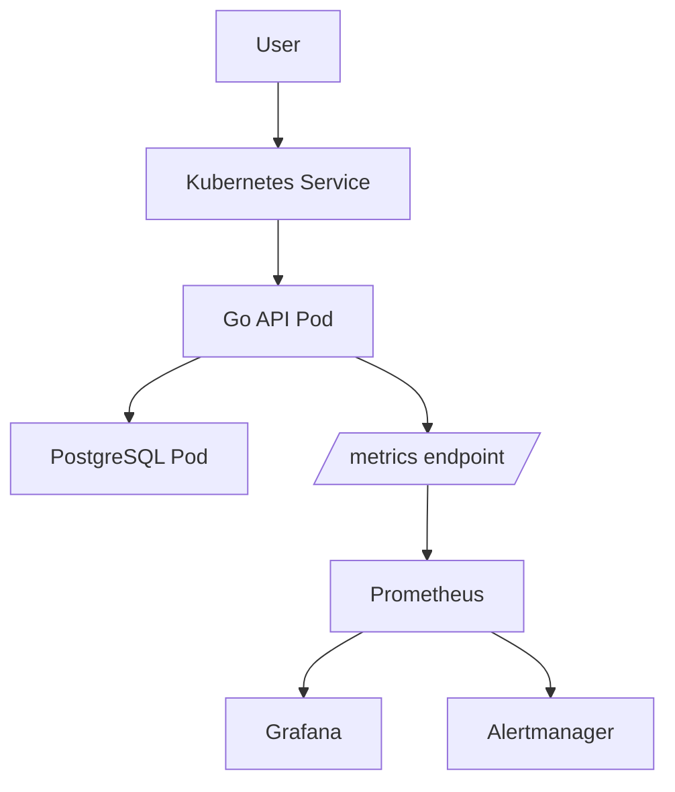
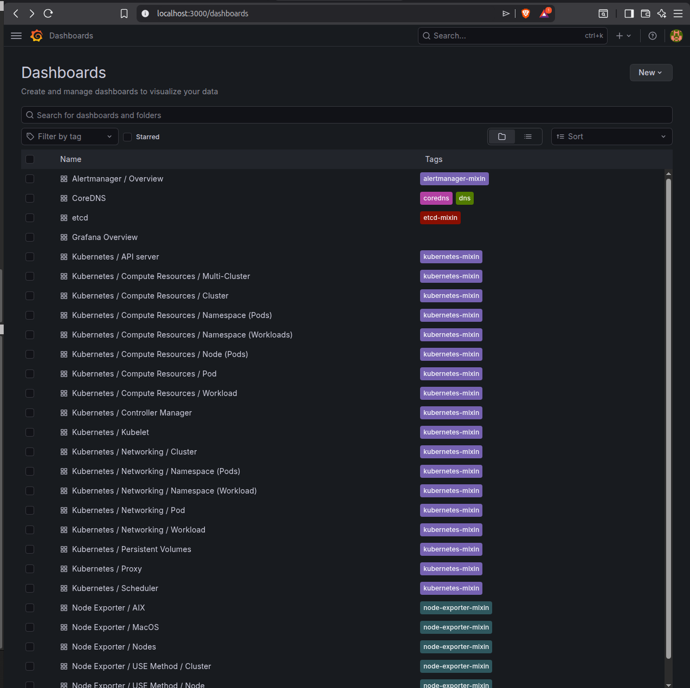
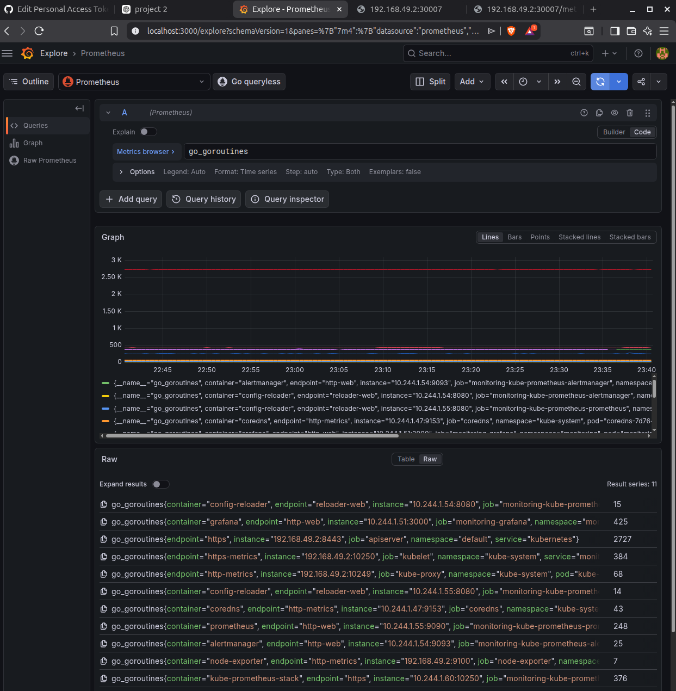
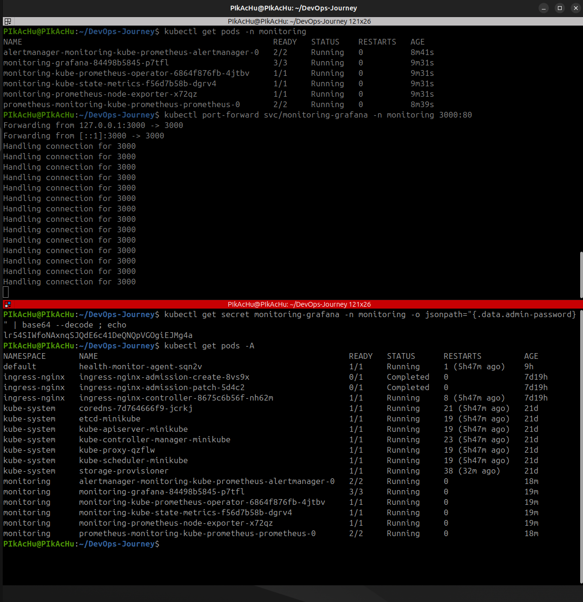

# DevOps Task Manager – Kubernetes Monitoring Project

This project demonstrates a **containerized Go REST API deployed on Kubernetes with a full monitoring stack** using Prometheus and Grafana.

## Architecture

---

## Tech Stack

| Layer | Technology |
|------|-------------|
Application | Go (Golang)
API Router | Chi
Database | PostgreSQL
Containerization | Docker
Orchestration | Kubernetes
Monitoring | Prometheus
Visualization | Grafana
CI/CD | GitHub Actions

---

# Features

- Containerized Go REST API
- Kubernetes deployment
- PostgreSQL database
- CI/CD pipeline with GitHub Actions
- Prometheus monitoring
- Grafana dashboards
- ServiceMonitor for automatic metric scraping

---

# API Endpoints

Health check
/api/v1/health

Users
GET /api/v1/users
POST /api/v1/users

Metrics endpoint
/metrics

---

# Kubernetes Deployment

Apply resources
kubectl apply -f k8s/

Check pods
kubectl get pods

---

# Monitoring Stack

Install monitoring stack
helm install monitoring prometheus-community/kube-prometheus-stack -n monitoring

Access Grafana
kubectl port-forward svc/monitoring-grafana -n monitoring 3000:80

---

# Screenshots

## Monitoring Screenshots

### Grafana Dashboard

### Prometheus Metrics Query

### Kubernetes Pods Running

---

## What I Learned

- Containerizing applications with Docker
- Deploying microservices on Kubernetes
- Managing PostgreSQL inside Kubernetes
- Implementing monitoring using Prometheus and Grafana
- Exposing application metrics using Prometheus client libraries
- Creating ServiceMonitor resources for automatic scraping

---

# Author

Debanjan Bhuinya
