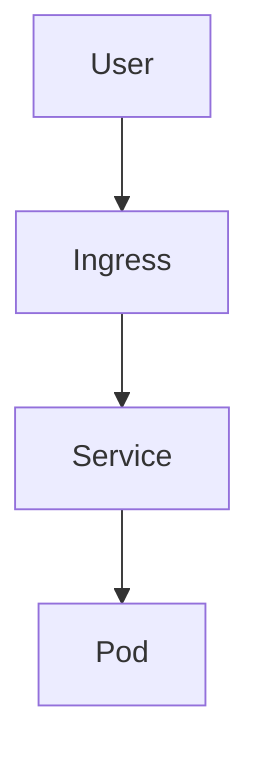
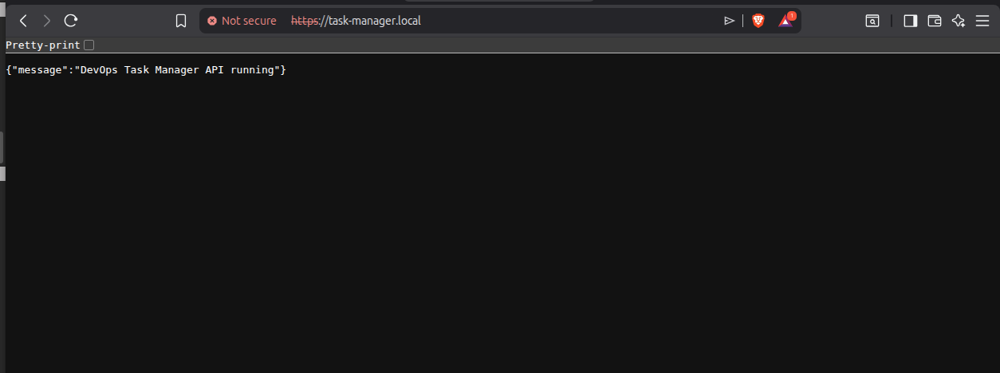
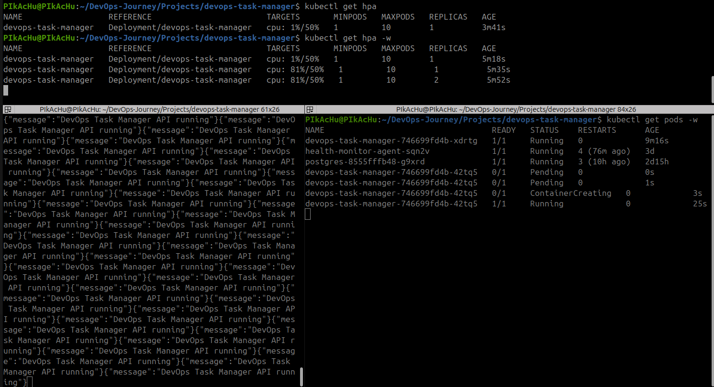
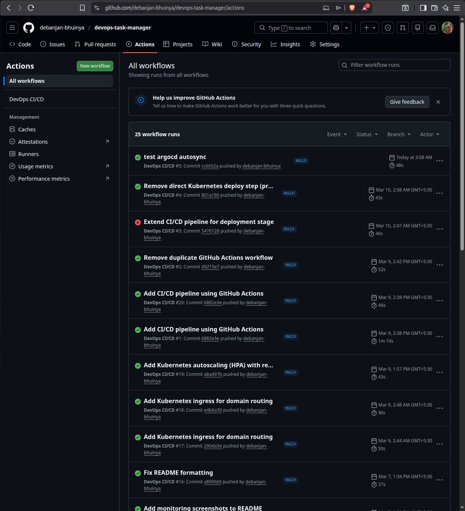
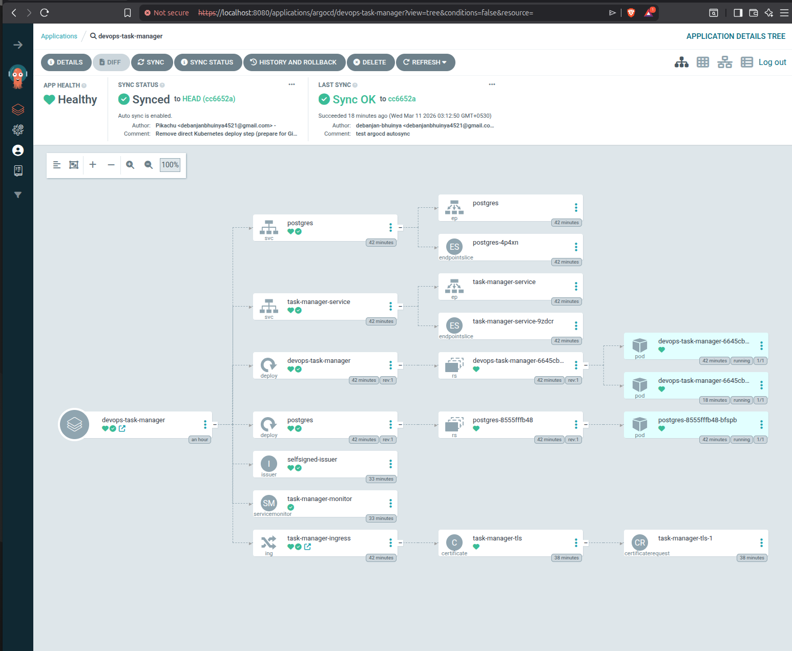

# DevOps Task Manager – Kubernetes Monitoring Project


[](https://github.com/debanjan-bhuinya/devops-task-manager/actions)

This project demonstrates a **containerized Go REST API deployed on Kubernetes with a full monitoring stack** using Prometheus and Grafana.

## Quick Start

Start Kubernetes cluster

minikube start

Deploy application

kubectl apply -f k8s/

Check running pods

kubectl get pods

Access application

https://task-manager.local

---

## DevOps Workflow

1. Developer pushes code to GitHub
2. GitHub Actions builds Docker image
3. Image is pushed to DockerHub
4. ArgoCD detects repository changes
5. Kubernetes cluster automatically syncs
6. Prometheus scrapes metrics
7. Grafana visualizes system performance

---

## Project Highlights

- Containerized Go API using Docker
- Kubernetes microservice deployment
- PostgreSQL database inside Kubernetes
- Monitoring with Prometheus and Grafana
- HTTPS using cert-manager
- Horizontal Pod Autoscaling (HPA)
- CI/CD automation with GitHub Actions
- GitOps deployment using ArgoCD

---

## DevOps Skills Demonstrated

- Containerization
- Kubernetes orchestration
- Infrastructure monitoring
- GitOps deployment
- CI/CD pipeline automation
- Microservice architecture
- Observability

---

## Full DevOps Architecture

```mermaid
graph TD

A[Developer Push Code] --> B[GitHub Repository]

B --> C[GitHub Actions CI]

C --> D[Docker Image Build]

D --> E[DockerHub]

E --> F[ArgoCD GitOps]

F --> G[Kubernetes Cluster]

G --> H[Go API Pods]

G --> I[PostgreSQL Database]

H --> J[/metrics endpoint]

J --> K[Prometheus]

K --> L[Grafana Dashboards]
```
---

## Tech Stack

| Layer | Technology |
|------|-------------|
Application | Go (Golang)
API Router | Chi
Database | PostgreSQL
Containerization | Docker
Orchestration | Kubernetes
Monitoring | Prometheus
Visualization | Grafana
CI/CD | GitHub Actions

---

# Features

- Containerized Go REST API
- Kubernetes deployment
- PostgreSQL database
- CI/CD pipeline with GitHub Actions
- Prometheus monitoring
- Grafana dashboards
- ServiceMonitor for automatic metric scraping

---

# API Endpoints

Health check
/api/v1/health


Users
GET /api/v1/users
POST /api/v1/users

Metrics endpoint
/metrics


---

# Kubernetes Deployment

Apply resources
kubectl apply -f k8s/

Check pods
kubectl get pods

---

## CI/CD Pipeline

The project uses GitHub Actions to automate the build and container publishing process.

Pipeline workflow:

1. Developer pushes code to GitHub
2. GitHub Actions builds the Docker image
3. Image is pushed to DockerHub
4. ArgoCD detects the change and deploys to Kubernetes

Example pipeline flow:

Developer → GitHub → GitHub Actions → DockerHub → ArgoCD → Kubernetes

---

## Kubernetes Ingress

The application is exposed using an NGINX Ingress Controller.

Example domain routing:

```
http://task-manager.local
```

Ingress architecture:



---

# Monitoring Stack

Install monitoring stack
helm install monitoring prometheus-community/kube-prometheus-stack -n monitoring


Access Grafana
kubectl port-forward svc/monitoring-grafana -n monitoring 3000:80

---

## HTTPS Enabled

The application is exposed securely using TLS certificates managed by cert-manager.

Endpoint:

https://task-manager.local



---

## Horizontal Pod Autoscaling

The application automatically scales based on CPU usage using Kubernetes HPA.

Configuration:

minPods: 1  
maxPods: 10  
targetCPUUtilization: 50%

Example scaling event:

cpu: 81% / 50% → Kubernetes created additional pods automatically.



---

## GitOps Deployment with ArgoCD

The deployment is managed using GitOps principles with ArgoCD.

ArgoCD continuously monitors the GitHub repository for changes in the Kubernetes manifests.

When a change is detected:

1. ArgoCD pulls the updated manifests
2. Compares them with the cluster state
3. Automatically synchronizes the cluster

This ensures that the Kubernetes cluster always reflects the desired state defined in Git.

GitOps workflow:

Git Push → ArgoCD Sync → Kubernetes Deployment

---

# Screenshots

## Monitoring Screenshots

### Grafana Dashboard


### Prometheus Metrics Query


### Kubernetes Pods Running


### GitHub Actions Pipeline



### ArgoCD Application Dashboard



---

## What I Learned

- Containerizing applications using Docker
- Deploying microservices to Kubernetes
- Managing PostgreSQL inside Kubernetes
- Implementing monitoring with Prometheus and Grafana
- Creating ServiceMonitor resources for metric scraping
- Exposing services using Kubernetes Ingress
- Securing applications using TLS with cert-manager
- Implementing Horizontal Pod Autoscaling (HPA)
- Building CI pipelines with GitHub Actions
- Implementing GitOps deployment using ArgoCD

---

## Future Improvements

- Centralized logging using Loki
- Distributed tracing using Jaeger
- Deploying the platform on AWS EKS or GKE
- Infrastructure provisioning with Terraform
- Implementing a service mesh using Istio

---

# Author

Debanjan Bhuinya
